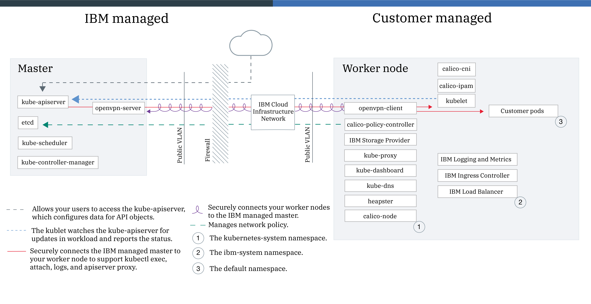
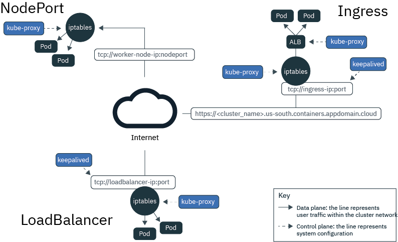

**IBM Kubenetes Service (IKS)**  
URL: [https://console.bluemix.net/docs/containers/cs_tutorials.html](https://console.bluemix.net/docs/containers/cs_tutorials.html)



## 1. Gain access to your cluster
### Prerequisites

To gain access to your cluster, download and install a few CLI tools and the IBM Cloud Kubernetes Service plug-in.

1. Download the IBM Cloud CLI.
2. Download the Kubernetes CLI.
3. Install the container service plugin.
`ibmcloud plugin install container-service -r Bluemix
`

### Gain access to your cluster
1. Log in to your IBM Cloud account.  
`
ibmcloud login -a https://api.ng.bluemix.net
`  
If you have a federated ID, use `ibmcloud login --sso` to log in to the IBM Cloud CLI.
2. Target the IBM Cloud Container Service region in which you want to work.  
`ibmcloud cs region-set us-south`  
3. Set the context for the cluster in your CLI.
 * Get the command to set the environment variable and download the Kubernetes configuration files.  
`
ibmcloud cs cluster-config mycluster
`
 * Set the KUBECONFIG environment variable. Copy the output from the previous command and paste it in your terminal. The command output should look similar to the following.
`
export KUBECONFIG=/Users/$USER/.bluemix/plugins/container-service/clusters/mycluster/kube-config-hou02-mycluster.yml
`  
Alternatively, you may directly download your kubeconfig files to manually configure the kubernetes cluster context.  
4. Verify that you can connect to your cluster by listing your worker nodes.  
`
kubectl get nodes
`

## Add an IBM Cloud service to your cluster
1. Choose a service and a plan from the IBM Cloud services in the catalog.
`
ibmcloud service offerings
`
2. Create an instance of a service.
`
ibmcloud service create SERVICE_NAME SERVICE_PLAN SERVICE_INSTANCE_NAME
`
3. Verify that the service instance was created.
`
ibmcloud service list
`
4. Add the service instance to your cluster.
`
ibmcloud cs cluster-service-bind 7431ed669ebf40ab8e80b349174a6d1a default SERVICE_INSTANCE_NAME
`
5. Verify that the Kubernetes secret was created in your cluster namespace.  
Every IBM Cloud service is defined by a JSON file that includes confidential information such as the user name, password, and URL that the container uses to gain access. To securely store this information, Kubernetes secrets are used.  
`
kubectl get secrets --namespace=default
` 

Now this service is available to developers in your cluster for use in their apps.

## Planning cluster networking
Choosing a NodePort, LoadBalancer, or Ingress service
o make your apps externally accessible from the public internet or a private network, IBM Cloud Kubernetes Service supports three networking services:

* **NodePort service** (free and standard clusters)

 *     Expose a port on every worker node and use the public or private IP address of any worker node to access your service in the cluster.
 *     Iptables is a Linux kernel feature that load balances requests across the app's pods, provides high-performance networking routing, and provides network access control.
 *     The public and private IP addresses of the worker node are not permanent. When a worker node is removed or re-created, a new public and a new private IP address are assigned to the worker node.
 *     The NodePort service is great for testing public or private access. It can also be used if you need public or private access for only a short amount of time.

* **LoadBalancer service** (standard clusters only)

 *     Every standard cluster is provisioned with four portable public and four portable private IP addresses that you can use to create an external TCP/UDP load balancer for your app.
 *     Iptables is a Linux kernel feature that load balances requests across the app's pods, provides high-performance networking routing, and provides network access control.
 *     The portable public and private IP addresses that are assigned to the load balancer are permanent and do not change when a worker node is re-created in the cluster.
 *     You can customize your load balancer by exposing any port that your app requires.

* **Ingress** (standard clusters only)

 *     Expose multiple apps in a cluster by creating one external HTTP or HTTPS, TCP, or UDP application load balancer (ALB). The ALB uses a secured and unique public or private entry point to route incoming requests to your apps.
 *     You can use one route to expose multiple apps in your cluster as services.
 * Ingress consists of two components:
      - The Ingress resource defines the rules for how to route and load balance incoming requests for an app.
      - The ALB listens for incoming HTTP or HTTPS, TCP, or UDP service requests. It forwards requests across the apps' pods based on the rules that you defined in the Ingress resource.
 * Use Ingress to implement your own ALB with custom routing rules and need SSL termination for your apps.

 
 

**Portal url:**  
[https://us-south.containers.bluemix.net/kubeproxy/clusters/7431ed669ebf40ab8e80b349174a6d1a/api/v1/namespaces/kube-system/services/https:kubernetes-dashboard:/proxy/#!/overview?namespace=default](https://us-south.containers.bluemix.net/kubeproxy/clusters/7431ed669ebf40ab8e80b349174a6d1a/api/v1/namespaces/kube-system/services/https:kubernetes-dashboard:/proxy/#!/overview?namespace=default)

**How to get node public IP  ?**  
instead of
   
```
kubectl get nodes    
ibmcloud cs worker [cluster-name]
```

**How to deploy on multi-nodes ?**  
**How apps communication among pods on different nodes**  

* clusterIP? 
* the Ingress subdomain of the cluster?
Retrieve the Ingress subdomain of the cluster:  
`
$ibmcloud cs cluster-get <us-cluster-name>
`
