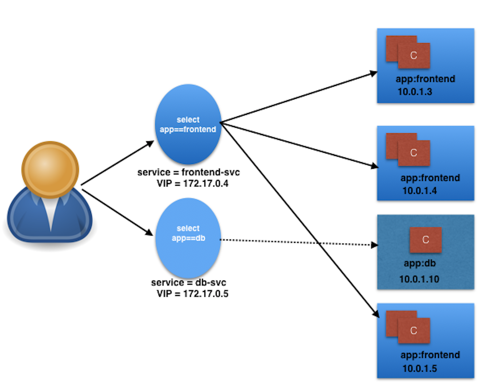
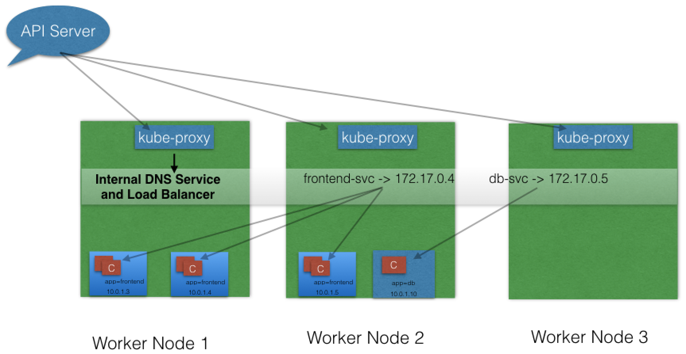
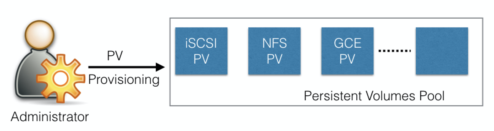
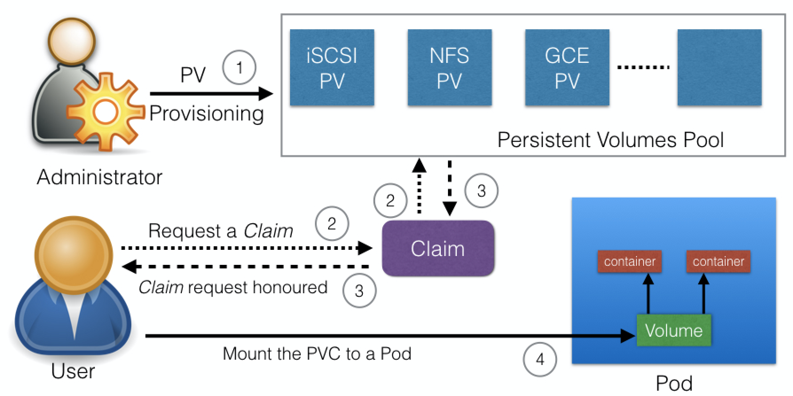

LinuxFoundationX: LFS158x  
[**Introduction to Kubernetes**](https://courses.edx.org/courses/course-v1:LinuxFoundationX+LFS158x+1T2018/course/)

**Table of Contents**  
[Chapter 1. Container Orchestration](#chapter-01)  
[Chapter 2. Kubernetes](#chapter-02)  
[Chapter 3. Kubernetes Architecture - Overview](#chapter-03)  
[Chapter 4. Installing Kubernetes](#chapter-04)  
[Chapter 5. Setting Up a Single-Node Kubernetes Cluster with Minikube](#chapter-05)  
[Chapter 6. Accessing Minikube](#chapter-06)    
[Chapter 7. Kubernetes Building Blocks](#chapter-07)  
[Chapter 8. Authentication, Authorization, Admission Control](#chapter-08)    
[Chapter 9. Services](#chapter-09)    
[Chapter 10. Deploying a Stand-Alone Application](#chapter-10)  
[Chapter 11. Kubernetes Volume Management](#chapter-11)  
[Chapter 12. Deploying a Multi-Tier Application](#chapter-12)  
[Chapter 13. ConfigMaps and Secrets](#chapter-13)  
[Chapter 14. Ingress](#chapter-14)  
[Chapter 15. Advanced Topics - Overview](#chapter-15)    
[Chapter 16. Kubernetes Community](#chapter-16)

#<a name="chapter-01"></a>Chapter 1. Container Orchestration  
**Objectives:**  

*             Define the concept of container orchestration.
*             Explain the reasons for doing container orchestration.
*             Discuss different container orchestration options.
*             Discuss different container orchestration deployment options.

**1. What Are Containers?**  
an application-centric way to deliver high-performing, scalable applications on the infrastructure of your choice.  
With a container image, we bundle the application along with its runtime and dependencies. We use that image to create an isolated executable environment, also known as container. We can deploy containers from a given image on the platform of our choice, such as desktops, VMs, cloud, etc.  

**2. What Is Container Orchestration?**  
Container orchestrators are the tools which group hosts together to form a cluster, and help us fulfill the requirements:

*             Are fault-tolerant
*             Can scale, and do this on-demand
*             Use resources optimally
*             Can discover other applications automatically, and communicate with each other
*             Are accessible from the external world 
*             Can update/rollback without any downtime. 

Nowadays, there are many container orchestrators available, such as:

*            **Docker Swarm**  
            Docker Swarm is a container orchestrator provided by Docker, Inc. It is part of Docker Engine.
*            **Kubernetes**  
            Kubernetes was started by Google, but now, it is a part of the Cloud Native Computing Foundation project.
*            **Mesos Marathon**  
            Marathon is one of the frameworks to run containers at scale on Apache Mesos.
*            **Amazon ECS**  
            Amazon EC2 Container Service (ECS) is a hosted service provided by AWS to run Docker containers at scale on its infrastructrue.
*            **Hashicorp Nomad**  
            Nomad is the container orchestrator provided by HashiCorp.
            
Container orchestrators can make things easy for operators:

*             Bring multiple hosts together and make them part of a cluster
*             Schedule containers to run on different hosts
*             Help containers running on one host reach out to containers running on other hosts in the cluster
*             Bind containers and storage
*             Bind containers of similar type to a higher-level construct, like services, so we don't have to deal with individual containers
*             Keep resource usage in-check, and optimize it when necessary
*             Allow secure access to applications running inside containers.


<a name="chapter-02"></a>
#Chapter 2. Kubernetes 
**Objectives:**  

1.             Define Kubernetes.
1.             Explain the reasons for using Kubernetes.
1.             Discuss the features of Kubernetes.
1.             Discuss the evolution of Kubernetes from Borg.
1.             Explain what the Cloud Native Computing Foundation does.

**1. Background**

* Cloud Native Computing Foundation (CNCF), which currently hosts the Kubernetes project, along with other cloud-native projects
* Kubernetes comes from the Greek word κυβερνήτης:, which means helmsman or ship pilot. With this analogy in mind, we can think of Kubernetes as the manager for shipping containers.
* Kubernetes was started by Google and, with its v1.0 release in July 2015, Google donated it to the Cloud Native Computing Foundation (CNCF). 

**2. Kubernetes features**  

*            **Automatic binpacking**              
            Kubernetes automatically schedules the containers based on resource usage and constraints, without sacrificing the availability.
*            **Self-healing**    
            Kubernetes automatically replaces and reschedules the containers from failed nodes. It also kills and restarts the containers which do not respond to health checks, based on existing rules/policy.
*            **Horizontal scaling**  
            Kubernetes can automatically scale applications based on resource usage like CPU and memory. In some cases, it also supports dynamic scaling based on customer metrics.
*            **Service discovery and Load balancing**  
Kubernetes groups sets of containers and refers to them via a Domain Name System (DNS). This DNS is also called a Kubernetes service. Kubernetes can discover these services automatically, and load-balance requests between containers of a given service.
*            **Automated rollouts and rollbacks**  
Kubernetes can roll out and roll back new versions/configurations of an application, without introducing any downtime.
*            **Secrets and configuration management**  
Kubernetes can manage secrets and configuration details for an application without re-building the respective images. With secrets, we can share confidential information to our application without exposing it to the stack configuration, like on GitHub.
*            **Storage orchestration**  
With Kubernetes and its plugins, we can automatically mount local, external, and storage solutions to the containers in a seamless manner, based on software-defined storage (SDS).
*            **Batch execution**  
Besides long running jobs, Kubernetes also supports batch execution.
*            **Portable and extensible**  
Kubernetes can be deployed on the environment of our choice, be it VMs, bare metal, or public/private/hybrid/multi-cloud setups. Also, Kubernetes has a very modular and pluggable architecture. We can write custom APIs or plugins to extend its functionalities.


#<a name="chapter-03"></a>Chapter 3. Kubernetes Architecture - Overview 

**Objectives:**

1.             Discuss the Kubernetes architecture.
1.             Explain the different components for master and worker nodes.
1.             Discuss about cluster state management with etcd.
1.             Review the Kubernetes network setup requirements.


#<a name="chapter-04"></a>Chapter 4. Installing Kubernetes 
**Objectives:**

1.             Discuss about the different Kubernetes configuration options.
1.             Discuss infrastructure considerations before installing Kubernetes.
1.             Discuss infrastructure choices for a Kubernetes deployment.
1.             Review Kubernetes installation tools and resources.

**1. Installation**  

* Localhost Installation 
  *            Minikube
  *            Ubuntu on LXD.  
* On-Premise Installation
  * On-Premise VMs. Kubernetes can be installed on VMs created via Vagrant, VMware vSphere, KVM, etc. There are different tools available to automate the installation, like Ansible or kubeadm.
* On-Premise Bare Metal. 
  * Kubernetes can be installed on on-premise bare metal, on top of different operating systems, like RHEL, CoreOS, CentOS, Fedora, Ubuntu, etc. Most of the tools used to install VMs can be used with bare metal as well. 
* Cloud Installation
  *          Google Kubernetes Engine (GKE)
  *          Azure Container Service (AKS)
  *          Amazon Elastic Container Service for Kubernetes (EKS) - Currently in Tech Preview
  *          OpenShift Dedicated
  *          Platform9
  *          IBM Cloud Container Service.
* Turnkey Cloud Solutions
  *          Google Compute Engine
  *          Amazon AWS
  *          Microsoft Azure
  *          Tectonic by CoreOS.
* Bare Metal ( Cloud )

#<a name="chapter-05"></a>Chapter 5. Setting Up a Single-Node Kubernetes Cluster with Minikube 
**Objectives:**  

 1. Discuss Minikube.
 1. Install Minikube on Linux, Mac, and Windows.
 1. Verify the installation.
 
           
#<a name="chapter-06"></a>Chapter 6. Accessing Minikube 
**Objectives:**  

1.             Review methods to access any Kubernetes cluster.
1.             Configure kubectl for Linux, macOS, and Windows.
1.             Access the Minikube dashboard.
1.             Access Minikube via APIs.

#<a name="chapter-07"></a>Chapter 7. Kubernetes Building Blocks 
**Objectives:**  

 1. Review the Kubernetes object model.
 1. Discuss Kubernetes building blocks, e.g. Pods, ReplicaSets,  Deployments, Namespaces.
 1. Discuss Labels and Selectors.

**1. Pod**

*         Pods are ephemeral in nature, and they do not have the capability to self-heal by themselves. 
*         That is why we use them with controllers, which can handle a Pod's replication, fault tolerance, self-heal, etc. 
*         Examples of controllers are Deployments, ReplicaSets, ReplicationControllers, etc. 
*         We attach the Pod's specification to other objects using Pods Templates, as we have seen in the previous section.
         
**2. Label**

*         Labels are key-value pairs that can be attached to any Kubernetes objects (e.g. Pods). 
*         Labels are used to organize and select a subset of objects, based on the requirements in place. 
*         Many objects can have the same Label(s). Labels do not provide uniqueness to objects.  
*                 Equality-Based Selectors.  =, ==, or != operators. For example, env==dev 
*                 Set-Based Selectors, the in, notin, and exist operators. For example, with env in (dev,qa)

**3. ReplicationController**

*         A ReplicationController (rc) is a controller that is part of the master node's controller manager. It makes sure the specified number of replicas for a Pod is running at any given point in time. 
*         Generally, we don't deploy a Pod independently, as it would not be able to re-start itself, if something goes wrong. 
*         We always use controllers like ReplicationController to create and manage Pods. 

**4. ReplicaSet**

*         A ReplicaSet (rs) is the next-generation ReplicationController. ReplicaSets support both equality- and set-based selectors, 
*         whereas ReplicationControllers only support equality-based Selectors.
*         ReplicaSets can be used independently, but they are mostly used by Deployments to orchestrate the Pod creation, deletion, and updates. 
*        A Deployment automatically creates the ReplicaSets, and we do not have to worry about managing them. 

**5. Deployment**

*         Deployment objects provide declarative updates to Pods and ReplicaSets. The DeploymentController is part of the master node's controller manager, 
*         and it makes sure that the current state always matches the desired state.
*         A rollout is only triggered when we update the Pods Template for a deployment. 
*         Operations like scaling the deployment do not trigger the deployment.

**6. Namespaces**
#<a name="chapter-08"></a>Chapter 8. Authentication, Authorization, Admission Control 


**Objectives:**

1. Discuss authentication, authorization, and access control stages of the Kubernetes API access.
1. Understand the different kinds of Kubernetes users.
1. Explore the different modules for authentication and authorization.

**1. Concepts**

* **Authentication**  
           Logs in a user.
* **Authorization**  
             Authorizes the API requests added by the logged-in user.
* **Admission Control**  
             Software modules that can modify or reject the requests based on some additional checks, like Quota. *--admission-control=NamespaceLifecycle, ResourceQuota, PodSecurityPolicy, DefaultStorageClass.*


**2. Kubernetes Users**

1.            **Normal Users.**  
            They are managed outside of the Kubernetes cluster via independent services like User/Client Certificates, a file listing usernames/passwords, Google accounts, etc.
1.           **Service Accounts.**  
            With Service Account users, in-cluster processes communicate with the API server to perform different operations. Most of the Service Account users are created automatically via the API server, but they can also be created manually. The Service Account users are tied to a given Namespace and mount the respective credentials to communicate with the API server as Secrets.
1.            **Anonymous.**  
            If properly configured, Kubernetes can also support anonymous requests, along with requests from Normal Users and Service Accounts.

**3. Authentication Methods**

1.          **Client Certificates.**  
            To enable client certificate authentication, we need to reference a file containing one or more certificate authorities by passing the --client-ca-file=SOMEFILE option to the API server. The certificate authorities mentioned in the file would validate the client certificates presented to the API server. A demonstration video covering this topic is also available at the end of this chapter.
1.          **Static Token File.**  
            We can pass a file containing pre-defined bearer tokens with the --token-auth-file=SOMEFILE option to the API server. Currently, these tokens would last indefinitely, and they cannot be changed without restarting the API server.
1.            **Bootstrap Tokens.**  
            This feature is currently in an alpha status, and is mostly used for bootstrapping a new Kubernetes cluster.
1.            **Static Password File.**  
            It is similar to Static Token File. We can pass a file containing basic authentication details with the --basic-auth-file=SOMEFILE option. These credentials would last indefinitely, and passwords cannot be changed without restarting the API server.
1.            **Service Account Tokens.**  
            This is an automatically enabled authenticator that uses signed bearer tokens to verify the requests. These tokens get attached to Pods using the ServiceAccount Admission Controller, which allows in-cluster processes to talk to the API server.
1.            **OpenID Connect Tokens.**  
            OpenID Connect helps us connect with OAuth 2 providers, such as Azure Active Directory, Salesforce, Google, etc., to offload the authentication to external services.
1.            **Webhook Token Authentication.**  
            With Webhook-based authentication, verification of bearer tokens can be offloaded to a remote service.
1.            **Keystone Password.**  
            Keystone authentication can be enabled by passing the --experimental-keystone-url=<AuthURL> option to the API server, where AuthURL is the Keystone server endpoint.
1.           **Authenticating Proxy.**  
            If we want to program additional authentication logic, we can use an authenticating proxy. 

#<a name="chapter-09"></a>Chapter 9. Services

**Objectives:**

1.             Discuss the benefits of grouping Pods into Services to access an application.
1.             Explain the role of the *kube-proxy* daemon running on each worker node.
1.             Explore the Service discovery options available in Kubernetes.
1.             Discuss different Service types.

**1. Service**  
 p{ white-space:pre-wrap;}
Kubernetes provides a higher-level abstraction called *Service*, which logically groups Pods and a policy to access them. This grouping is achieved via Labels and Selectors, which we talked about in the previous chapter. 

**2. kube-proxy**  
All of the worker nodes run a daemon called kube-proxy, which watches the API server on the master node for the addition and removal of Services and endpoints. For each new Service, on each node, kube-proxy configures the iptables rules to capture the traffic for its ClusterIP and forwards it to one of the endpoints. When the service is removed, kube-proxy removes the iptables rules on all nodes as well.


**3. Service Discovery**  

* Environment Variables
* DNS add-on

**4. ServiceType**  

1. *ClusterIP*  
  is the default ServiceType. A Service gets its Virtual IP address using the ClusterIP.
1. *NodePort*  
in addition to creating a ClusterIP, a port from the range 30000-32767 is mapped to the respective Service, from all the worker nodes. The end-user connects to the worker nodes on the specified port, which forwards the traffic to the applications running inside the cluster.
1. *LoadBalancer*  （specific vendor support)
 * NodePort and ClusterIP Services are automatically created, and the external load balancer will route to them  
 * The Services are exposed at a static port on each worker node  
 * The Service is exposed externally using the underlying cloud provider's load balancer feature.
1. *ExternalIP*  （specific vendor support)
Traffic that is ingressed into the cluster with the ExternalIP (as destination IP) on the Service port, gets routed to one of the the Service endpoints.
1. *ExternalName* （specific vendor support)  
configured Services like my-database.example.com available inside the cluster, using just the name, like my-database, to other Services inside the same Namespace.

#<a name="chapter-10"></a> Chapter 10. Deploying a Stand-Alone Application

**Objectives:**

 1.             Deploy an application from the dashboard.
 1.             Deploy an application from a YAML file using kubectl.
 1.             Expose a service using NodePort.
 1.             Access the application from the external world.  

**1. Deploy Application**		

1. **Deploying an Application Using the Minikube GUI**

2. **Deploying the Application Using the CLI**

 Step 1. Create a YAML file with Deployment details
   
>>```
apiVersion: apps/v1
kind: Deployment
metadata:
  name: webserver
  labels:
    app: nginx
spec:
  replicas: 3
  selector:
    matchLabels:
      app: nginx
  template:
    metadata:
      labels:
        app: nginx
    spec:
      containers:
      - name: nginx
        image: nginx:alpine
        ports:
        - containerPort: 80
>>```
  
  Step 2. Creating a Service and Exposing It to the External World with NodePort  

  Step 3.  Create a webserver-svc.yaml file with the following content: 

>>```
apiVersion: v1
kind: Service
metadata:
  name: web-service
  labels:
    run: web-service
spec:
  type: NodePort
  ports:
  - port: 80
    protocol: TCP
  selector:
    app: nginx 
>>```    

** 2. Liveness and Readiness Probes **

**Liveness probe** checks on an application's health, and, if for some reason, the health check fails, it restarts the affected container automatically.  
Sometimes, applications have to meet certain conditions before they can serve traffic. These conditions include ensuring that the depending service is ready, or acknowledging that a large dataset needs to be loaded, etc. In such cases, we use **Readiness Probes** and wait for a certain condition to occur. Only then, the application can serve traffic.

#<a name="chapter-11"></a> Chapter 11. Kubernetes Volume Management 
**Objectives:**
 
1.            Explain the need for persistent data management.
1.            Discuss Kubernetes Volume and its types.
1.            Discuss PersistentVolumes and PersistentVolumeClaims.

**1. Volume Types**  

*            **emptyDir**  
            An empty Volume is created for the Pod as soon as it is scheduled on the worker node. The Volume's life is tightly coupled with the Pod. If the Pod dies, the content of emptyDir is deleted forever.  
*            **hostPath**  
            With the hostPath Volume Type, we can share a directory from the host to the Pod. If the Pod dies, the content of the Volume is still available on the host.
*            **gcePersistentDisk**  
            With the gcePersistentDisk Volume Type, we can mount a Google Compute Engine (GCE) persistent disk into a Pod.
*            **awsElasticBlockStore**              
            With the awsElasticBlockStore Volume Type, we can mount an AWS EBS Volume into a Pod. 
*            **nfs**  
            With nfs, we can mount an NFS share into a Pod.
*            **iscsi**  
            With iscsi, we can mount an iSCSI share into a Pod.
*            **secret**  
            With the secret Volume Type, we can pass sensitive information, such as passwords, to Pods. We will take a look at an example in a later chapter.
*            **persistentVolumeClaim**              
            We can attach a PersistentVolume to a Pod using a persistentVolumeClaim.  

**2. PersistentVolumes**  
A Persistent Volume is a network-attached storage in the cluster, which is provisioned by the administrator.  
PersistentVolumes can be dynamically provisioned based on the StorageClass resource. A StorageClass contains pre-defined provisioners and parameters to create a PersistentVolume. Using PersistentVolumeClaims, a user sends the request for dynamic PV creation, which gets wired to the StorageClass resource.


**3. PersistentVolumeClaims**  
A **PersistentVolumeClaim (PVC)** is a request for storage by a user. Users request for PersistentVolume resources based on size, access modes, etc. Once a suitable PersistentVolume is found, it is bound to a PersistentVolumeClaim.

Once a user finishes its work, the attached PersistentVolumes can be released. The underlying PersistentVolumes can then be reclaimed and recycled for future usage. 

**4. Container Storage Interface (CSI)**  
third-party storage providers can develop solutions without the need to add them into the core Kubernetes codebase.

#<a name="chapter-12"></a> Chapter 12. Deploying a Multi-Tier Application 
**Objectives:**
 
1.             Analyze a sample multi-tier application.
1.             Deploy a multi-tier application.
1.             Scale an application.

#<a name="chapter-13"></a> Chapter 13. ConfigMaps and Secrets 
**Objectives:**
 
1.            Discuss configuration management for applications in Kubernetes using ConfigMaps.  
1.             Share sensitive data (such as passwords) using Secrets.

 
**1. ConfigMaps**   
ConfigMap,  pass such runtime parameters like configuration details.
 Secret, when we want to pass sensitive information.
Decouple the configuration details from the container image. Using ConfigMaps, we can pass configuration details as key-value pairs, which can be later consumed by Pods, or any other system components, such as controllers.  
A ConfigMap can be created with the **kubectl create** command, and we can get the values using the **kubectl get** command.

```
$ kubectl create configmap my-config --from-literal=key1=value1 --from-literal=key2=value2
$ kubectl get configmaps my-config -o yaml
```
As a Volume
We can mount a ConfigMap as a Volume inside a Pod. For each key, we will see a file in the mount path and the content of that file becomes the respective key's value

**2. Secrets**  
we can share sensitive information like passwords, tokens, or keys in the form of key-value pairs, similar to ConfigMaps;
In Deployments or other system components, the Secret object is referenced, without exposing its content. the Secret data is stored as plain text inside etcd. 

```
$ kubectl create secret generic my-password --from-literal=password=mysqlpassword  
$ kubectl get secret my-password
$ kubectl describe secret my-password
```
#<a name="chapter-14"></a> Chapter 14. Ingress
**Objectives:**
 
1.            Explain what Ingress and Ingress Controllers are.
1.            Learn when to use Ingress.
1.            Access an application from the external world using Ingress.  

**1. Concepts**  
"An Ingress is a collection of rules that allow inbound connections to reach the cluster Services."   
Ingress configures a Layer 7 HTTP load balancer for Services and provides the following:
   
*            TLS (Transport Layer Security)
*            Name-based virtual hosting 
*            Path-based routing
*            Custom rules.

**2. Example**  
An Ingress Controller is an application which watches the Master Node's API server for changes in the Ingress resources and updates the Layer 7 Load Balancer accordingly. 

```
apiVersion: extensions/v1beta1
kind: Ingress
metadata:
  name: web-ingress
  namespace: default
spec:
  rules:
  - host: blue.example.com
    http:
      paths:
      - backend:
          serviceName: webserver-blue-svc
          servicePort: 80
  - host: green.example.com
    http:
      paths:
      - backend:
          serviceName: webserver-green-svc
          servicePort: 80
          
$ kubectl create -f webserver-ingress.yaml   
$ cat /etc/hosts
127.0.0.1        localhost
::1              localhost
192.168.99.100   blue.example.com green.example.com        
```


#<a name="chapter-15"></a> Chapter 15. Advanced Topics 
**1. Annotations**  
In contrast to Labels, annotations are not used to identify and select objects. With Annotations, we can attach arbitrary non-identifying metadata to any objects, in a key-value format:Annotations can be used to:

*            Store build/release IDs, PR numbers, git branch, etc.
*            Phone/pager numbers of people responsible, or directory entries specifying where such information can be found
*            Pointers to logging, monitoring, analytics, audit repositories, debugging tools, etc.

**2. Deployment Features**  

* Recording a Deployment - if something goes wrong, we can revert to the working state.
*            Autoscaling
*            Proportional scaling
*            Pausing and resuming.

**3. Jobs**  
Such as **cron jobs**.
A Job creates one or more Pods to perform a given task. The Job object takes the responsibility of Pod failures. It makes sure that the given task is completed successfully. Once the task is over, all the Pods are terminated automatically.

**4. Quota Management**  
quotas per Namespace  

* **Compute Resource Quota**         
            We can limit the total sum of compute resources (CPU, memory, etc.) that can be requested in a given Namespace.
* **Storage Resource Quota**            
            We can limit the total sum of storage resources (PersistentVolumeClaims, requests.storage, etc.) that can be requested.
* **Object Count Quota**            
            We can restrict the number of objects of a given type (pods, ConfigMaps, PersistentVolumeClaims, ReplicationControllers, Services, Secrets, etc.).  
            
**5. DaemonSets**  
**6. StatefulSets**  
**7. Kubernetes Federation**  
**8. Custom Resources**  
**9. Helm**      

 - **Chart**. We can bundle all those manifests after templatizing them into a well-defined format, along with other metadata.       
 - **Helm** is a package manager for Kubernetes, which can install/update/delete those Charts in the Kubernetes cluster.
   *            A client called *helm*, which runs on your user's workstation
   *            A server called *tiller*, which runs inside your Kubernetes cluster.

**10. Monitoring and Logging**

* **Heapster** is a cluster-wide aggregator of monitoring and event data
* **Prometheus**, can also be used to scrape the resource usage from different Kubernetes components and objects. Using its client libraries, we can also instrument the code of our application.
* **Elasticsearch**, ollect the logs from different components of a given system
* **fluentd** is an open source data collector, with custom configuration as an agent on the nodes. 

#<a name="chapter-16"></a> Chapter 16. Kubernetes Community 

**Kubernetes 常用命令**

命令 | 解释
----|----- 
Kubernetes命令行 – 集群状态 | 	
kubectl cluster-info |	查看集群信息 
kubectl version |	显示kubectl命令行及kube服务端的版本 
kubectl api-version |	显示支持的API版本集合 
kubectl config view |	显示当前kubectl配置 
kubectl get no |	查看集群中节点 
Kubernetes命令行 – 创建新资源 | 	
kubectl create -f <res.yaml> |	按照yaml文件创建资源 
kubectl run <name> --image=<image> |	使用某镜像创建Deployment 
Kubernetes命令行 – 检查与调试 | 	
kubectl get <type> <name> |	查看某种类型资源 
kubectl describe <type> <name> |	检查某特定资源实例 
kubectl logs |	检查某POD的日志(标准输出) 
kubectl exec |	在容器内执行命令 
Kubernetes命令行 – 部署管理 |
kubectl scale |	实现水平扩展或收缩 
kubectl rollout status |	部署状态变更状态检查 
kubectl rollout history |	部署的历史 
kubectl rollout undo |	回滚部署到最近或者某个版本
Kubernetes命令行 – 删除资源 |	
kubectl delete <type> <name> |	
