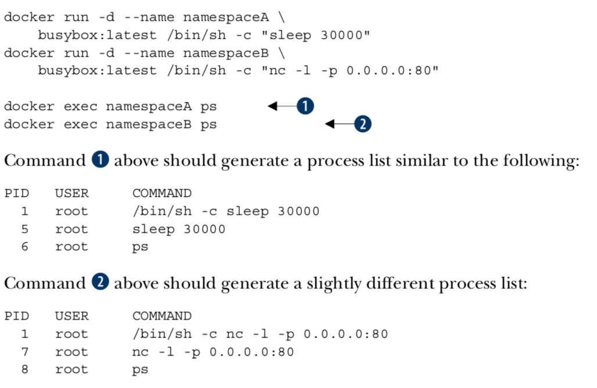

PDF Book: [Docker In Action](../img/dockerinaction/DockerinAction.pdf)
# 1 Welcome to Docker
## 1.1 What's Docker ?
Container  - **concealed processes**  
Container are not virtualization  - **unix process**  
Running software in containers for isolation  - **inter-process interruption**  
Shipping containers - **image**  


## 1.2 What problems does Docker solve ?
1. Getting orgainzed  - **junk drawer to isolated container & images**


2. Improving portability  

- Using a virtual machine to contain a single program is wasteful. 
- This is especially so when you’re running several virtual machines on the same computer.
- Docker uses a single, small virtual machine to run all the containers. 
- By taking this approach, the overhead of running a virtual machine is fixed while the number of containers can scale up.
Portecting your computer


## 1.3 Why is Docker important ?
1. easier for sys adm & software dev (container abstraction & tooling)
2. push forward by large software companies & community
3. same apps store for all mobile devices ( install, compartmentalization & remove)
4. possible isolation of operation systems

## 1.4 Where & Wehn to use Docker ?
1. NOT for OS X or Windows native application
2. NOT for security programs that have to run with full access to the machine
2. software that typically runs on a Linux server or desktop
3. add in-depth defense
4. Keep compute clean 


# 2. Running software in containers
## 2.1 Get help with Docker command line
**docker help**

```
Management Commands:
  config      Manage Docker configs
  container   Manage containers
  image       Manage images
  network     Manage networks
  node        Manage Swarm nodes
  plugin      Manage plugins
  secret      Manage Docker secrets
  service     Manage services
  stack       Manage Docker stacks
  swarm       Manage Swarm
  system      Manage Docker
  volume      Manage volumes

Commands:
  attach      Attach local standard input, output, and error streams to a running container
  build       Build an image from a Dockerfile
  commit      Create a new image from a container's changes
  cp          Copy files/folders between a container and the local filesystem
  create      Create a new container
  diff        Inspect changes to files or directories on a container's filesystem
  events      Get real time events from the server
  exec        Run a command in a running container
  export      Export a container's filesystem as a tar archive
  history     Show the history of an image
  images      List images
  import      Import the contents from a tarball to create a filesystem image
  info        Display system-wide information
  inspect     Return low-level information on Docker objects
  kill        Kill one or more running containers
  load        Load an image from a tar archive or STDIN
  login       Log in to a Docker registry
  logout      Log out from a Docker registry
  logs        Fetch the logs of a container
  pause       Pause all processes within one or more containers
  port        List port mappings or a specific mapping for the container
  ps          List containers
  pull        Pull an image or a repository from a registry
  push        Push an image or a repository to a registry
  rename      Rename a container
  restart     Restart one or more containers
  rm          Remove one or more containers
  rmi         Remove one or more images
  run         Run a command in a new container
  save        Save one or more images to a tar archive (streamed to STDOUT by default)
  search      Search the Docker Hub for images
  start       Start one or more stopped containers
  stats       Display a live stream of container(s) resource usage statistics
  stop        Stop one or more running containers
  tag         Create a tag TARGET_IMAGE that refers to SOURCE_IMAGE
  top         Display the running processes of a container
  unpause     Unpause all processes within one or more containers
  update      Update configuration of one or more containers
  version     Show the Docker version information
  wait        Block until one or more containers stop, then print their exit codes
```
## 2.2 Controlling container: build a website monitor
```
docker logs 
docker run / start /stop / restart /pause
docker kill / rm
docker ps / inspect / exec
docker images / rmi
docker search / pull /save /tag
```

## 2.3 Solved problems and the PID namespace
Here are some common conflict problems:   

- Two programs want to bind to the same *network port*.
- Two programs use the same *temporary filename*, and file locks are preventing
that.
- Two programs want to use different versions of some globally installed *library*.
- Two copies of the same program want to use the *same PID file*.
- A second program you installed *modified an environment variable* that another
program uses. Now the first program breaks.

Docker solves software conflicts with such tools as *Linux namespaces, file system roots, and virtualized network components*. All these tools are used to provide isolation to each container.


## 2.4 Eliminating metaconflicts: building a website farm
1. Container ID, abbreviated container ID, or its human-friendly name.  
	**PID:** hex-encoded 1024-bit numbers, or 16 * heximal characters:  
	7cb5 d2b9 a7ea b87f 0718 2b5b f589 36c9 9478 9099 5b1b 94f4 1291 2fa8 22a9 ecb5  
	
	**CID file** uses known names in a global (Docker-wide) namespace: `docker create --cidfile /tmp/web.cid nginx`.  Docker won’t create a new container using the provided CID file if that file already exists. The command will fail just as it does when you create two containers with the same name.  
2. All containers are in any one of four distinct states: running, paused, restarting, or exited.

  

## 2.5 Building enviornment-agnostic systems
1. Read-only file systems  
	Using the --read-only flag at container-creation time will mount the container file system as read-only and prevent specialization of the container. 
	 
	docker run -d --name wp *--read-only* wordpress:4  

2. Environment variable injection  
docker create \   
    --env WORDPRESS_DB_HOST="my database hostname" \  
    --env WORDPRESS_DB_USER=site_admin \  
    --env WORDPRESS_DB_PASSWORD=MeowMix42 \  
      wordpress:4

## 2.6 Building duarable containers
1. Automatically restarting containers  
	Using the --restart flag at container-creation time, you can tell Docker to do any of the following:    
	■ Never restart (default)  
	■ Attempt to restart when a failure is detected  
	■ Attempt for some predetermined time to restart when a failure is detected  
	■ Always restart the container regardless of the condition  
	
	Docker uses an exponential backoff strategy for timing restart attempts.  
	LAMP stack (Linux, Apache, MySQL, PHP)

2. Keeping containers running with supervisor and startup processes  
	kill a process inside of a container from within that con- tainer, you need to know the PID in the container’s PID namespace. 
	
	`
	docker top lamp-test,     
	docker exec lamp-test ps
	` 
	
	A common alternative to the use of init or supervisor programs is using a startup script that at least checks the preconditions for successfully starting the contained soft- ware. These are sometimes used as the default command for the container. 

## 2.7 Cleaning up
1. remove / kill containers  
docker rm -vf $(docker ps -a -q)

2. remove images  
docker rmi  -f $(docker images)


# 3.Software installation simplified

## 3.1 Identify software
**image ID, repository, Tag**  
  A repository is a named bucket of images. The name is similar to a URL. A repository’s name is made up of the name of the host where the image is located, the user account that owns the image, and a short name.  
  

## 3.2 Find & Install
  
DockerHub: [https://hub.docker.com](https://hub.docker.com)  
docker login / logout  
docker search
docker run  
docker load / save
docker images / rmi  

4 ways to install software:

1. DockerHub repository by default:  
  `docker run -it dockerinaction/ch3_ex2_hunt`

2. use alternative repository registries or run your own registry. REGISTRYHOST/USERNAME/NAME:TAG
  `docker pull quay.io/dockerinaction/ch3_hello_registry:latest ` 

3. manually load images from a file.  
	
	`docker pull busybox:latest`  
	`docker save -o myfile.tar busybox:latest`   
	`docker rmi busybox`  
	`docker load –i myfile.tar`
	
4. download a project from some other source and build an image using a provided Dockerfile.
	`git clone https://github.com/dockerinaction/ch3_dockerfile.git` 
	`docker build -t dia_ch3/dockerfile:latest ch3_dockerfile`

## 3.3 Container file system abstraction and isolation


1. union file system  
create mount points on your host’s file system that abstract the use of layers. The layers created are what are bundled into Docker image layers.  
when a Docker image is installed, its layers are unpacked and appro- priately configured for use by the specific file system provider chosen for your system.  

  PROS: single copy, seperation  
  CONS: compatible for different file systems.
2. MNT namespaces  
The Linux kernel provides a namespace for the MNT system. When Docker creates a container, that new container will have its own MNT namespace, and a new mount point will be created for the container to the image.
3. chroot system call.  
make the root of the image file system the root in the con- tainer’s context. This prevents anything running inside the container from referenc- ing any other part of the host file system.

#4. Persistent storage and shared state with volumes
## 4.1 Introducing volumes


* A *volume* is a mount point on the con- tainer’s directory tree where a portion of the host directory tree has been mounted.
* images are appropriate for packaging and distributing relatively static files like programs; volumes hold dynamic data or specializations. 
* This distinction makes images reusable and data simple to share. 


volume container.  


1. Specify volume mount point inside the container:
	
		docker run -d \  
		    --volume /var/lib/cassandra/data \
		    --name cass-shared \
		    alpine echo Data Container
    
2. Inherit volume definitions

		docker run -d \
		    --volumes-from cass-shared \
		    --name cass1 \
		    cassandra:2.2
3. run a Cassandra client tool and connect to your running server
		    
		docker run –it --rm \
		    --link cass1:cass \
		    cassandra:2.2 cqlsh cass

## 4.2 Volume type
**Bind mount volumes** use any user-specified directory or file on the host operating system

		docker run -d --name bmweb \
		    -v ~/example-docs:/usr/local/apache2/htdocs \
		    -p 80:80 \
		    httpd:latest
**Managed volumes** use locations of Docker managed space,  created by the Docker daemon in space controlled by the daemon

		docker run -d \
		    -v /var/lib/cassandra/data \
		    --name cass-shared \
		    alpine echo Data Containe


## 4.3 Sharing volumes
1. Host-dependent sharing  
created four containers, each of which mounted the same direc- tory as a volume. The first two containers are writing to different files in that volume. The third and fourth containers mount the volume at a different location and as read- only. 

		docker run --name woolf -d \
		            --volume ~/web-logs-example:/data \
		            dockerinaction/ch4_writer_a
		docker run --name alcott -d \
		            -v ~/web-logs-example:/data \
		            dockerinaction/ch4_writer_b
		docker run --rm --entrypoint head \
		            -v ~/web-logs-example:/towatch:ro \
		            alpine:latest \
		            /towatch/logA
		docker run --rm \
		            -v ~/web-logs-example:/toread:ro \
		            alpine:latest \
		            head /toread/logB
2. Generalized sharing


* The docker run command provides a flag that will copy the volumes from one or more containers to the new container. 
* The flag --volumes-from can be set multiple times to specify multiple source containers.		

		#create 2 volume: fowler, knuth    
		docker run --name fowler \
		            -v ~/example-books:/library/PoEAA \
		            -v /library/DSL \
		            alpine:latest \
		            echo "Fowler collection created."
		            
		docker run --name knuth \
		    -v /library/TAoCP.vol1 \
		    -v /library/TAoCP.vol2 \
		    -v /library/TAoCP.vol3 \
		    -v /library/TAoCP.vol4.a \
		    alpine:latest \
		    echo "Knuth collection created"
		
		#List all volumes as they were copied into new container    
		docker run --name reader \
		    --volumes-from fowler \
		    --volumes-from knuth \
		    alpine:latest ls -l /library/
		    
		#Checkout volume list for reader    
		docker inspect --format "{{json .Volumes}}" reader    
 
* You can copy volumes directly or transitively. 
   
		#Create an aggregation
		docker run --name aggregator \
		    --volumes-from fowler \
		    --volumes-from knuth \
		    alpine:latest \
		    echo "Collection Created."
		
		#Consume volumes from a single source and list them                            
		docker run --rm \
		    --volumes-from aggregator \
		    alpine:latest \
		    ls -l /library/

## 4.4 The managed volume life cycle
docker rm -v student

## 4.5 Container patterns
1. volume container  
	* keeping a handle on data even in cases where a single container should have exclusive access to some data. These handles make it possible to easily back up, restore, and migrate data.
	* keeping your volumes organized and avoiding the orphan volume problem.

2. Data-packed volume container  
	* distribute static resources like configuration or code for use in containers created with other images.  
	* A data-packed volume container is built from an image that copies static content from its image to volumes it defines. In doing so, these containers can be used to dis- tribute critical architecture information like configuration, key material, and code. 
	* distributing static con- tent for other containers.

			Copy image content into a volume
			docker run --name dpvc \
			    -v /config \
			    dockerinaction/ch4_packed /bin/sh -c 'cp /packed/* /config/'
			
			List shared material
			docker run --rm --volumes-from dpvc \
			    alpine:latest ls /config    
			
			View shared material
			docker run --rm --volumes-from dpvc \
			    alpine:latest cat /config/packedData
			Remember to use –v when you clean up
			docker rm -v dpvc
3. Polymorphic container  
	* provides some functionality that’s easily substituted using volumes.   
	* compose minimal functional components and maximize reuse.		 

# 5. Network exposure
##5.1 Concepts


## 5.2 Docker Container Networking


### 1. Closed containers

		#Create a closed container, list the interfaces
	    docker run --rm \
	    --net none \
	    alpine:latest \
	    ip addr
	    
	    #Test by ping Google -"“ping: send-to: Network is unreachable.” 
	    docker run --rm \
	    --net none \
	    alpine:latest \
	    ping -w 2 8.8.8.8 

  - doesn’t allow any network traffic, access to the network or the internet won’t operate correctly 
  - access only to a loopback interface, only communicate with themselves or each other
  - Use case: network isolation is the highest or whenever a program doesn’t require network access. eg. 
     - Running a terminal text editor
     - Running a program to generate a random password

### 2. Bridged containers
have a private loopback interface and another private interface that’s connected to the rest of the host through a network bridge

		#Create a closed container, list the interfaces
	    docker run --rm \
	    --net bridge \
	    alpine:latest \
	    ip addr
	    
	    #Test by ping Google -"“ping: send-to: Network is unreachable.” 
	    docker run --rm \
	    --net bridge \
	    alpine:latest \
	    ping -w 2 8.8.8.8 


**2.1 reach out**
		
		docker run --rm \
    		--net bridge \
    		alpine:latest \
		    ip addr
		    
		docker run --rm \
    		--net bridge \
    		alpine:latest \
    		ping -w 2 8.8.8.8    
    		
**2.2 Custom name resolution (hostname)**

		#Set the container host name, resolve to an IP address
		docker run --rm \
	    	--hostname barker \
   		 	alpine:latest \
    		nslookup barker    		
    		
    	===>
			Name:      barker
			Address 1: 172.17.0.22 barker	
			
**2.2 Custom name resolution (DNS assignment)**

		#Set primary DNS server, Resolve IP address of docker.com
		docker run --rm \ 
			--dns 8.8.8.8 \ 
			alpine:latest \
    		nslookup docker.co
    			
**2.2 Custom name resolution (DNS Search order)**

    	#Set search domain, Look up shortcut for registry.hub.docker.com
    	docker run --rm \
    		--dns-search docker.com \
    		busybox:latest \
    		nslookup registry.hub
    	docker run --rm \
    		--dns-search docker.com  \
    		--dns-search myothercompany ...
**2.2 Custom name resolution (DNS override)**

		# add an entry on /etc/hosts
		docker run --rm \
			--hostname mycontainer \
    		-add-host docker.com:127.0.0.1 \
    		--add-host test:10.10.10.2 \
    		alpine:latest \
    			cat /etc/hosts
**2.3 Opening inbound communication**  
	If DNS is your best tool for changing outbound traffic behavior, then the firewall and network topology is your best tool for controlling inbound traffic.
	  
	
	Example | Comment
	---------+----------
	docker run -p 3333 | host:* to container:3000
	docker run -p 3333:3333 | host:3000 to container:3000
	docker run -p 192.168.0.32::2222 | 192.168.0.32:* to container:2222
	docker run -p 192.168.0.32:1111:1111 | 192.168.0.32:1111 to container:1111
	
	- "--publish-all" or "-P", to expose all available
	- docker ps / inspect / port, see the mappings.

**2.4 Inter-container communication**

* Allowing communication in this way makes it simple to build cooperating contain- ers. No additional work needs to be done to build pipes between containers. It’s as free as an open network.
* you can configure it to disallow network con- nections between containers. by setting --icc=false 
* When inter-container communication is disabled, any traffic from one container to another will be blocked by the host’s firewall except where explicitly allowed.
	

	
**2.5 Modifying the bridge interface**

* Define the address and subnet of the bridge. `docker -d --fixed-cidr "192.168.0.192/26`
* Define the range of IP addresses that can be assigned to containers
* Define the maximum transmission unit (MTU). `docker -d –mtu 1200`

### 3. Joined containers
* These containers share a common network stack. 
* In this way there’s no isolation between joined containers. 
* This means reduced control and security.  
* The best reasons to use joined containers
	1. Use joined containers when you want to use a single loopback interface for commu- nication between programs in different containers.
	1. Use joined containers if a program in one container is going to change the joined net- work stack and another program is going to use that modified network.
	1. Use joined containers when you need to monitor the network traffic for a program in another container.
	
			docker run -d --name brady \
			    --net none alpine:latest \
			    nc -l 127.0.0.1:3333
			docker run -it \
			    --net container:brady \
			    alpine:latest netstat –al

### 4. Open containers
have no network container and have full access to the host’s network.
provide absolutely no isolation  
processes can bind to protected network ports numbered lower than 1024.


	docker run --rm \
	    --net host \
	    alpine:latest ip addr


## Inter-container dependencies

### 3 approaches:
Bridge network. assigns IP addresses to containers dynamically at creation time, local service discovery can seem complicated.

1. use a local DNS server and a registration hook when containers start.
   * handle dynamic environments
2. write a programs to scan the local network for IP addresses listening on known ports.
	* require a non-trivial workload and additional tooling
	* fail if arbitrary inter-container communication has been disabled.
	* force all traffic out and back through the host’s interface to known published ports.
3. links for local service discovery

### links for local service discovery
When you create a new container, tell Docker to link it to any other running container.
Adding a link on a new container does three things:

* Environment variables describing the target container’s end point will be cre- ated.
* The link alias will be added to the DNS override list of the new container with the IP address of the target container.
* Most interestingly, if inter-container communication is disabled, Docker will add specific firewall rules to allow communication between linked containers.

		# Named target of a link
		docker run -d --name importantData \
		    --expose 3306 \
		    dockerinaction/mysql_noauth \
		    service mysql_noauth start
		    
		# Create link and set alias to db     
		docker run -d --name importantWebapp \
		    --link imporantData:db \
		    dockerinaction/ch5_web startapp.sh -db tcp://db:3306
		
		# This container has no route to importantData.
		docker run -d --name buggyProgram \
		    dockerinaction/ch5_buggy    
		    
# 6. Limiting risk with isolation

Containers provide isolated process contexts, not whole system virtualization. The semantic difference may seem subtle, but the impact is drastic. What to cover:

* how to give containers resource allowances
* open access to shared memory
* run programs as specific users
* control the type of changes that a container can make to your computer
* integrate with otherLinux isolation tools.


## 6.1 Resource Allowance

docker run / create [ memory | CPU | device ] [ n units ]

	# Set a memory constraint
	docker run -d --name ch6_mariadb \
	    --memory 256m \
	    --cpu-shares 1024
	    --user nobody \
	    --cap-drop all \
	    dockerfile/mariadb
	    
	# Set a relative process weight on CPU
	docker run -d -P --name ch6_wordpress \
		--memory 512m \
		--cpu-shares 512 \
		--user nobody \
		--cap-drop net_raw \
		--link ch6_mariadb \
		wordpress:4.1 

	# Restrict to CPU number 0
	docker run -d \
 		--cpuset-cpus 0 \
		--name ch6_stresser 
		dockerinaction/ch6_stresser	
	
	# Mount video0	
	docker -it --rm \
    	--device /dev/video0:/dev/video0 \
    	ubuntu:latest ls -al /dev
## 6.2 Shared memory
### (1)Sharing IPC primitives between containers: "--IPC"
	#Start producer
	docker -d -u nobody
		--name ch6_ipc_producer \
	   dockerinaction/ch6_ipc -producer
	
	#Start consumer
	docker -d 
		 --name ch6_ipc_consumer \
	    --ipc container:ch6_ipc_producer \
	    dockerinaction/ch6_ipc -consumer 
	
	#view data produced & consumed
	docker logs ch6_ipc_producer
	docker logs ch6_ipc_consumer
	
	#remove
	docker rm -vf ch6_ipc_producer ch6_ipc_consumer


### (2)Using an open memory container

	# Start a producer, Use open memory container
	docker -d --name ch6_ipc_producer \
	    --ipc host \
	    dockerinaction/ch6_ipc –producer
	
	# Start a consumer, Use open memory container
	docker -d --name ch6_ipc_consumer \
	    --ipc host \
	    dockerinaction/ch6_ipc -consumer
	    
	# Clean up
	docker rm -vf ch6_ipc_producer ch6_ipc_consumer

## 6.3 Users
**USR namespace**. File system inside a container,  except for volume, will not be impactedby inherited user privilege. 

* Displays the metadata of a specific container: `docker inspect [ container ]`
* the run-as user might be changed by whatever script the image uses to start up: boot, or init, scripts. Thus as this ` docker run --rm --entrypoint "" busybox:latest whoami` or `id`
* Get a list of available users in an image. `docker run --rm busybox:latest awk -F: '$0=$1' /etc/passwd`
* you might consider learning to start setting passwords or disabling the root account like Ubuntu and others. 
* The best way to be confident in your runtime configuration is to pull images from trusted sources or build your own.

		# Set run-as user:group
		docker run --rm \
		    -u 10000:20000 \
		    busybox:latest id
		    
## 6.4. run w/ Privileged user: --privileged
docker create or docker run 

docker run --rm 
    --privileged 
    ubuntu:latest id

also fully network

docker run --rm 
    --privileged 
    --host 
    ubuntu:latest id
## 6.5 Build use-case-appropriate containers

In reality, people tend to be a bit more reactive than proactive.Start with the most isolated container you can build and justify reasons for weakening those restrictions. 

The best approach is to isolate the risk. 

1. Make sure the application is running as a user with limited permissions. That way, if there’s a problem, it won’t be able to change the files on your computer.
2. Limit the system capabilities of the browser. In doing so, you make sure your system configuration is safer. 
3. Set lim-its on how much of the CPU and memory the application can use. Limits help reserve resources to keep the system responsive. 
4. Specifically whitelist devices that it can access. That will keep snoops off your webcam, USB, and the like.
    
	
# 7 Packaging software in images
**Objectives:**	

* New images are created when changes to a container are committed using the docker commit command.
* When a container is committed, the configuration it was started with will be encoded into the configuration for the resulting image.
* An image is a stack of layers that’s identified by its top layer.
* An image’s size on disk is the sum of the sizes of its component layers.
* Images can be exported to and imported from a flat tarball representation using the docker export and docker import commands.
* The docker tag command can be used to assign several tags to a single repository.
* Repository maintainers should keep pragmatic tags to ease user adoption and migration control.
* Tag your latest stable build with the latest tag.
* Provide fine-grained and overlapping tags so that adopters have control of the scope of their dependency version creep.

**Configurable image attributes**

* All environment variables
* The working directory
* The set of exposed ports
* All volume definitions
* The container entrypoint
* Command and arguments


# 8 Build automation and advanced image considerations

**Objectives:**

* Docker provides an automated image builder that reads instructions from Dockerfiles.
* Each Dockerfile instruction results in the creation of a single image layer.
* Merge instructions whenever possible to minimize the size of images and layer count.
* Dockerfiles include instructions to set image metadata like the default user, exposed ports, default command, and entrypoint.
* Other Dockerfile instructions copy files from the local file system or remote location into the produced images.
* Downstream builds inherit build triggers that are set with ONBUILD instructions in an upstream Dockerfile.
* Startup scripts should be used to validate the execution context of a container before launching the primary application.
* A valid execution context should have appropriate environment variables set, network dependencies available, and an appropriate user configuration.
* Init programs can be used to launch multiple processes, monitor those pro- cesses, reap orphaned child processes, and forward signals to child processes.
* Images should be hardened by building from content addressable image identifiers, creating a non-root default user, and disabling or removing any executable with SUID or SGID permissions.


## Packaging Git with a Dockerfile

Dockerfile 分为四部分：基础镜像信息、维护者信息、镜像操作指令和容器启动时执行指令。’#’ 为 Dockerfile 中的注释。

```
# This my first nginx Dockerfile
# Version 1.0

# Base images 基础镜像
FROM centos

#MAINTAINER 维护者信息
MAINTAINER tianfeiyu 

#ENV 设置环境变量
ENV PATH /usr/local/nginx/sbin:$PATH

#ADD  文件放在当前目录下，拷过去会自动解压
ADD nginx-1.8.0.tar.gz /usr/local/  
ADD epel-release-latest-7.noarch.rpm /usr/local/  

#RUN 执行以下命令 
RUN rpm -ivh /usr/local/epel-release-latest-7.noarch.rpm
RUN yum install -y wget lftp gcc gcc-c++ make openssl-devel pcre-devel pcre && yum clean all
RUN useradd -s /sbin/nologin -M www

#WORKDIR 相当于cd
WORKDIR /usr/local/nginx-1.8.0 

RUN ./configure --prefix=/usr/local/nginx --user=www --group=www --with-http_ssl_module --with-pcre && make && make install

RUN echo "daemon off;" >> /etc/nginx.conf

#EXPOSE 映射端口
EXPOSE 80

#CMD 运行以下命令
CMD ["nginx"]
```

 FROM : 指定基础镜像，要在哪个镜像建立

    格式为 FROM <image> 或FROM <image>:<tag> 。

第一条指令必须为 FROM 指令。

MAINTAINER：指定维护者信息

    格式为 MAINTAINER <name>

RUN：在镜像中要执行的命令

    格式为 RUN <command> 或 RUN ["executable", "param1", "param2"]

前者将在 shell 终端中运行命令，即 /bin/bash -c ；后者则使用 exec 执行。指定使用其它终端可以通过第二种方式实现，例如 RUN [“/bin/bash”, “-c”,”echo hello”] 。

WORKDIR：指定当前工作目录，相当于 cd

    格式为 WORKDIR /path/to/workdir

为后续的 RUN 、 CMD 、 ENTRYPOINT 指令配置工作目录。
可以使用多个 WORKDIR 指令，后续命令如果参数是相对路径，则会基于之前命令指定的路径。例如

    WORKDIR /a
    WORKDIR b
    WORKDIR c
    RUN pwd

则最终路径为 /a/b/c 。

EXPOSE：指定容器要打开的端口

    格式为 EXPOSE <port> [<port>...]

告诉 Docker 服务端容器暴露的端口号，供互联系统使用。在启动容器时需要通过 -P，Docker 主机会自动分配一个端口转发到指定的端口。

ENV：定义环境变量

格式为 ENV <key> <value> 。 指定一个环境变量，会被后续 RUN 指令使用，并在容器运行时保持。
例如

    ENV PATH /usr/local/nginx/sbin:$PATH

COPY ：复制本地主机的 （为 Dockerfile 所在目录的相对路径）到容器中的

    格式为 COPY 。

ADD：相当于 COPY，但是比 COPY 功能更强大

    格式为 ADD <src> <dest>

该命令将复制指定的 到容器中的 。 其中 可以是Dockerfile所在目录的一个相对路径；也可以是一个 URL；还可以是一个 tar 文件，复制进容器会自动解压。

VOLUME：挂载目录

    格式为VOLUME ["/data"]

创建一个可以从本地主机或其他容器挂载的挂载点，一般用来存放数据库和需要保持的数据等。

USER

    格式为 USER daemon

指定运行容器时的用户名或 UID，后续的 RUN 也会使用指定用户。当服务不需要管理员权限时，可以通过该命令指定运行用户。并且可以在之前创建所需要的用户，例如： RUN useradd -s /sbin/nologin -M www。

ENTRYPOINT

两种格式：

    ENTRYPOINT ["executable", "param1", "param2"]
     
    ENTRYPOINT command param1 param2 （shell中执行）

配置容器启动后执行的命令，并且不可被 docker run 提供的参数覆盖。每个 Dockerfile 中只能有一个 ENTRYPOINT ，当指定多个时，只有最后一个起效。

CMD

支持三种格式

    CMD ["executable","param1","param2"] 使用 exec 执行，推荐方式；
    CMD command param1 param2 在 /bin/bash 中执行，提供给需要交互的应用；
    CMD ["param1","param2"] 提供给 ENTRYPOINT 的默认参数；

指定启动容器时执行的命令，每个 Dockerfile 只能有一条 CMD 命令。如果指定了多条命令，只有最后一条会被执行。如果用户启动容器时候指定了运行的命令，则会覆盖掉 CMD 指定的命令。

ONBUILD：在构建本镜像时不生效，在基于此镜像构建镜像时生效

    格式为 ONBUILD [INSTRUCTION]

配置当所创建的镜像作为其它新创建镜像的基础镜像时，所执行的操作指令。

ENTRYPOINT 和 CMD 的区别：ENTRYPOINT 指定了该镜像启动时的入口，CMD 则指定了容器启动时的命令，当两者共用时，完整的启动命令像是 ENTRYPOINT + CMD 这样。使用 ENTRYPOINT 的好处是在我们启动镜像就像是启动了一个可执行程序，在 CMD 上仅需要指定参数；另外在我们需要自定义 CMD 时不容易出错。

使用 CMD 的 Dockerfile：

    [root@sta2 test]# cat Dockerfile 
    FROM mysql
     
    CMD ["echo","test"]

使用 ENTRYPOINT 的 Dockerfile：

    [root@sta2 entrypoint]#  cat  Dockerfile 
    FROM mysql
     
    ENTRYPOINT ["echo","test"]

结论：ENTRYPOINT 不能覆盖掉执行时的参数，CMD 可以掉覆盖默认的参数。

# 9. Choosing a distribution method

## 9.1 Choosing a distribution method
**A distribution spectrum**


**Selection criteria**

1. **COST**  
Cost is the most obvious criterion, and the distribution spectrum ranges in cost from free to very expensive and “it’s complicated.” Lower cost is generally better, but cost is typically the most flexible criterion. For example, most people will trade cost for arti- fact confidentiality if the situation calls for it.
2. **VISIBILITY**  
Visibility is the next most obvious criterion for a distribution method. Secret projects or internal tools should be difficult if not impossible for unauthorized people to dis- cover. In another case, public works or open source projects should be as visible as possible to promote adoption.
3. **TRANSPORTATION**  
Transportation speed and bandwidth overhead are the next most flexible criteria. File sizes and image installation speed will vary between methods that leverage image lay- ers, concurrent downloads, and prebuilt images and those that use flat image files or rely on deployment time image builds. High transportation speeds or low installation latency is critical for systems that use just-in-time deployment to service synchronous requests. The opposite is true in development environments or asynchronous process- ing systems.
4. **LONGEVITY**  
Longevity control is a business concern more than a technical concern. Hosted distri- bution methods are subject to other people’s or companies’ business concerns. An executive faced with the option of using a hosted registry might ask, “What happens if they go out of business or pivot away from repository hosting?” The question reduces to, “Will the business needs of the third party change before ours?” If this is a concern for you, then longevity control is important. Docker makes it simple to switch between methods, and other criteria like requisite expertise or cost may actually trump this concern. For those reasons, longevity control is another of the more flexible criteria.
5. **AVAILABILITY**  
Availability control is the ability to control the resolution of availability issues with your repositories. Hosted solutions provide no availability control. Businesses typically provide some service-level agreement on availability if you’re a paying customer, but there’s nothing you can do to directly resolve an issue. On the other end of the spec- trum, private registries or custom solutions put both the control and responsibility in your hands.
6. **ACCESS CONTROL**  
Access control protects your images from modification or access by unauthorized par- ties. There are varying degrees of access control. Some systems provide only access control of modifications to a specific repository, whereas others provide course con- trol of entire registries. Still other systems may include pay walls or digital rights man- agement controls. Projects typically have specific access control needs dictated by the product or business. This makes access control requirements one of the least flexible and most important to consider.
7. **INTEGRITY**  
Artifact integrity and confidentiality both fall in the less-flexible and more-technical end of the spectrum. Artifact integrity is trustworthiness and consistency of your files and images. Violations of integrity may include man-in-the-middle attacks, where an attacker intercepts your image downloads and replaces the content with their own. They might also include malicious or hacked registries that lie about the payloads they return.
8. **CONFIDENTIALITY**  
Artifact confidentiality is a common requirement for companies developing trade secrets or proprietary software. For example, if you use Docker to distribute crypto- graphic material, then confidentiality will be a major concern. Artifact integrity and confidentiality features vary across the spectrum. Overall, the out-of-the-box distribu- tion security features won’t provide the tightest confidentiality or integrity. If that’s one of your needs, an information security professional will need to implement and review a solution.
9. **SKILLS**  
The last thing to consider when choosing a distribution method is the level of expertise required. Using hosted methods can be very simple and requires little more than a mechanical understanding of the tools. Building custom image or image source distribution pipelines requires expertise with a suite of related technologies. If you don’t have that expertise or don’t have access to someone who does, using more complicated solutions will be a challenge. In that case, you may be able to reconcile the gap at additional cost.


## 9.2 Hosted registries (public / private)
### 9.2.1 Publishing with public repositories: Hello World via Docker Hub 
HelloWorld.df
	FROM busybox:latest
	CMD echo Hello World


https://hub.docker.com/
docker login
docker push <jonathanliuyangs>/hello-dockerfile
docker build \
    -t <insert Docker Hub username>/hello-dockerfile \
    -f HelloWorld.df \
docker search   jonathanliuyangs


### 9.2.2 Publishing public projects with automated builds

  

git remote add origin \
    https://github.com/<your username>/hello-docker.git
// auto build on DockerHub    
git add Dockerfile
git commit -m "first commit"
git push -u origin master    

defaults write com.apple.screencapture location /Users/jonathanliu/Jonathanliu92251.github.io/img/dockerinaction
/Users/jonathanliu/Jonathanliu92251.github.io/img/dockerinaction>killall SystemUIServer

## 9.3 Private registries 
  
  
  
  docker running process
  local image cache, 
  local / remote repository
  
  1. Starting a local registry in a container can be done with a single command:
     In this example, the registry location is localhost:5000. you can use docker pull, run, tag, and push commands.
  
	    docker run -d -p 5000:5000 \
	           -v "$(pwd)"/data:/tmp/registry-dev \
	           --restart=always --name local-registry registry:2

  2. copying images from Docker Hub into your new registry:
	
		docker pull dockerinaction/ch9_registry_bound
		docker images -f "label=dia_excercise=ch9_registry_bound"
		docker tag dockerinaction/ch9_registry_bound \
		    localhost:5000/dockerinaction/ch9_registry_bound
		docker push localhost:5000/dockerinaction/ch9_registry_bound

  3. copying images from Docker Hub into your new registry:
		
		docker pull localhost:5000/dockerinaction/ch9_registry_bound
		docker exec -it 4e12b823c8cb "/bin/sh"
		
## 9.4 Manual image (tar file)


docker pull registry:2
docker save -o ./registry.2.tar registry:2
docker load -i registry.2.tar		

## 9.5 Image source (built from source)

1. build /publish
 
		git init
		git config --global user.email "you@example.com"
		git config --global user.name "Your Name"
		git add Dockerfile
		
		# git add *whatever other files you need for the image*
		git commit -m "first commit"
		git remote add origin https://github.com/<your username>/<your repo>.git 
		git push -u origin master

2. get & build

		git clone https://github.com/<your username>/<your repo>.git
		cd <your-repo>
		docker build -t <your username>/<your repo> .

# 10. Running customized registries

**Different registries**


## 1. Personal
default: /var/lib/registry

	docker run -d --name personal_registry \
	    -p 5000:5000 --restart=always \
	    registry:2
	    
	docker tag registry:2 localhost:5000/distribution:2
	docker push localhost:5000/distribution:2  
	
	docker rmi localhost:5000/distribution:2
	docker pull localhost:5000/distribution:2
  
## 2. Centralized
## 3. Centralized durable
## 4. Fast & scalable
## 5. Integrated
## Registry API V2
 [Registry API V2](https://docs.docker.com/registry/spec/api/)
 
# 11. Declarative environments with Docker Compose

**Docker Compose**

an auxiliary Docker client, provides features that relieve much of the tedium associated with commandline management of containers. Defining, launching, and managing services, where a service is defined as one or more replicas of a Docker container

1. Compose uses environment definitions that are provided in YAML configura- tion files
2. docker-compose commandline, can build images, launch and manage services, scale services, and view logs on any host running a Docker daemon
3. similar to docker command-line commands. Building, starting, stopping, removing, and listing services 
4. Declaring environment configuration with YAML enables environment version- ing, sharing, iteration, and consistency.

# 12. Clusters with Machine and Swarm

Name      | Comments| Strategy|
----------|---------|-------
Scheduleing |Selecting a machine based on machine’s hardware, and network locality | Spread, BinPack, Random
Service discovery|resolving the location of a named service
Registration|Advertising the availability of a service at a specific location


